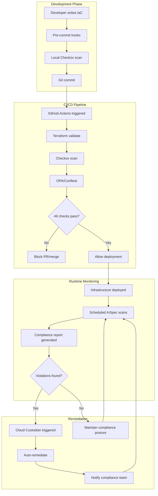
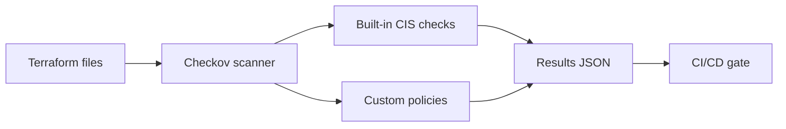
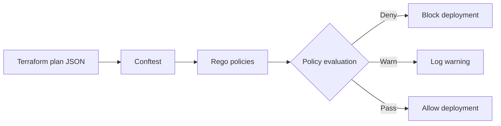
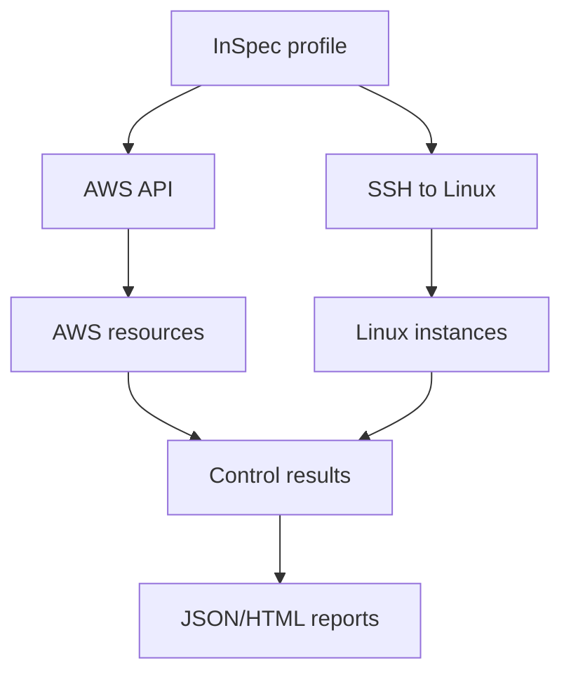
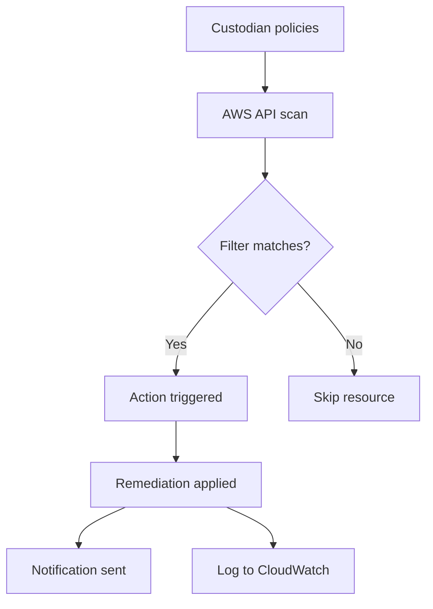
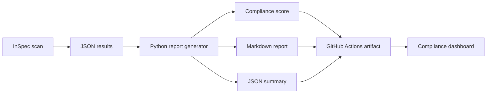
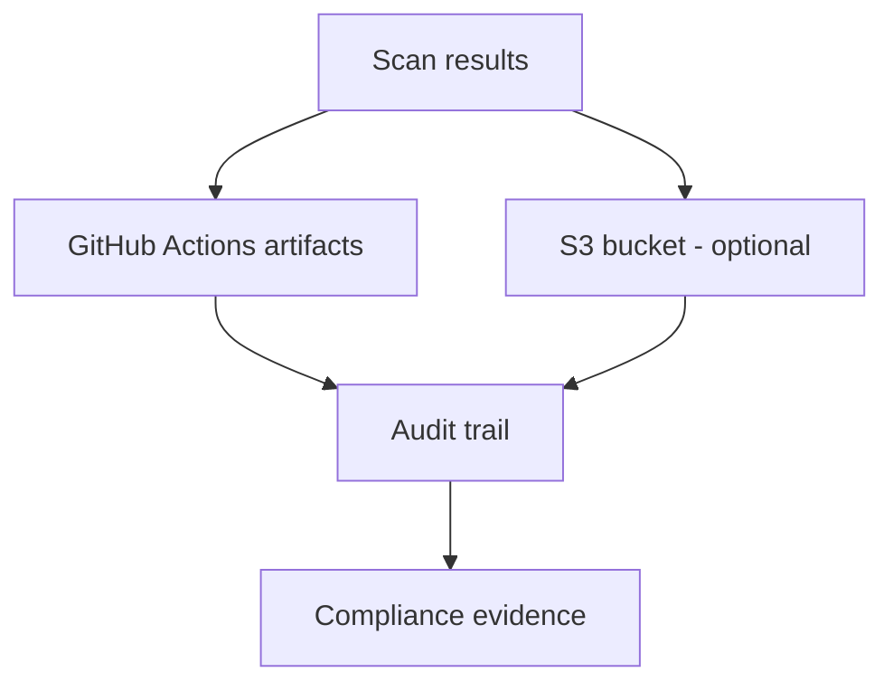
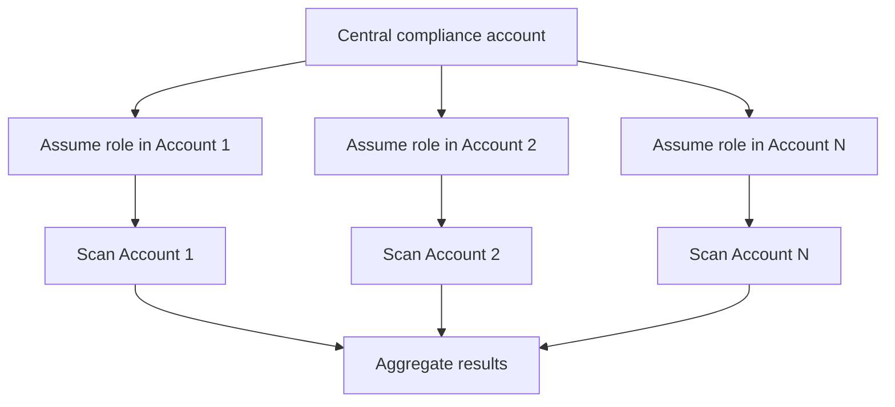

# Architecture - CIS Benchmark Compliance-as-Code Framework

## System Overview

The CIS Benchmark Compliance-as-Code framework implements a multi-layered approach to cloud compliance, providing preventive, detective, and corrective controls across the infrastructure lifecycle.



## Architecture Layers

### Layer 1: Pre-Deploy Gates (Shift-Left Security)

**Purpose**: Prevent non-compliant infrastructure from being deployed.

**Components**:
- **Checkov**: Static analysis of Terraform/CloudFormation
- **OPA (Conftest)**: Policy-as-code validation
- **Pre-commit hooks**: Local validation before commit

**Flow**:
1. Developer writes Terraform code
2. Pre-commit hooks run Checkov locally (optional)
3. Developer commits and pushes code
4. GitHub Actions triggers on PR
5. Terraform validation runs
6. Checkov scans IaC files
7. OPA validates against custom policies
8. PR is blocked if critical violations found

**Benefits**:
- Catches violations early in development
- Reduces cost of fixing issues
- Provides immediate feedback to developers

### Layer 2: Runtime Verification (Continuous Monitoring)

**Purpose**: Detect drift and violations in deployed infrastructure.

**Components**:
- **InSpec**: Runtime compliance testing
- **Scheduled scans**: Weekly automated checks
- **Compliance reporting**: Automated report generation

**Flow**:
1. Scheduled GitHub Action triggers (weekly)
2. InSpec connects to AWS via API
3. InSpec runs CIS Benchmark controls
4. Results exported to JSON/HTML
5. Python script generates compliance report
6. Report uploaded as GitHub artifact
7. Compliance score calculated and tracked

**Benefits**:
- Detects manual changes (drift)
- Validates actual deployed state
- Provides audit trail

### Layer 3: Automated Remediation (Self-Healing)

**Purpose**: Automatically fix violations when detected.

**Components**:
- **Cloud Custodian**: AWS resource remediation
- **Ansible**: Linux instance remediation
- **AWS Config Rules**: Native AWS remediation (optional)

**Flow**:
1. Violation detected by InSpec or Custodian
2. Cloud Custodian policy matches violation
3. Remediation action triggered (if enabled)
4. Change logged and notification sent
5. Follow-up scan verifies remediation

**Benefits**:
- Reduces MTTR (Mean Time To Remediate)
- Ensures consistent compliance posture
- Reduces manual toil

## Component Architecture

### Checkov Integration



**Configuration**:
- `.checkov.yaml`: Checkov configuration
- `policies/checkov/`: Custom policies (if needed)

**Key Features**:
- 1000+ built-in policies
- CIS Benchmark checks included
- JSON output for automation
- Inline skip annotations

### OPA/Conftest Integration



**Configuration**:
- `policies/opa/*.rego`: Rego policy files

**Key Features**:
- Custom policy logic
- Terraform plan analysis
- Flexible deny/warn rules

### InSpec Integration



**Configuration**:
- `policies/inspec/aws-cis-benchmark/`: AWS controls
- `policies/inspec/linux-cis-benchmark/`: Linux controls

**Key Features**:
- Native AWS resource inspection
- SSH-based Linux inspection
- Multiple output formats
- Waiver support for exceptions

### Cloud Custodian Integration



**Configuration**:
- `policies/custodian/*.yml`: Custodian policy files

**Key Features**:
- Real-time or scheduled execution
- Dry-run mode
- Multiple action types (modify, delete, notify)
- CloudWatch integration

## Data Flow

### Compliance Data Pipeline



### Evidence Storage



## Security Considerations

### Secrets Management

- AWS credentials stored in GitHub Secrets
- Never commit credentials to repository
- Use IAM roles with least privilege
- Rotate credentials regularly

### IAM Permissions

**Minimum permissions for scanning**:
```json
{
  "Version": "2012-10-17",
  "Statement": [
    {
      "Effect": "Allow",
      "Action": [
        "s3:GetBucket*",
        "s3:ListAllMyBuckets",
        "cloudtrail:DescribeTrails",
        "cloudtrail:GetTrailStatus",
        "ec2:DescribeSecurityGroups",
        "iam:GetAccountPasswordPolicy",
        "iam:ListUsers",
        "iam:ListAccessKeys"
      ],
      "Resource": "*"
    }
  ]
}
```

**Additional permissions for remediation**:
```json
{
  "Effect": "Allow",
  "Action": [
    "s3:PutBucketPublicAccessBlock",
    "s3:PutEncryptionConfiguration",
    "ec2:RevokeSecurityGroupIngress",
    "cloudtrail:UpdateTrail"
  ],
  "Resource": "*"
}
```

### Audit Logging

All remediation actions are logged:
- GitHub Actions logs (retained for 90 days)
- CloudWatch Logs (if using Cloud Custodian)
- S3 bucket for long-term storage (optional)

## Scalability

### Multi-Account Support



**Implementation**:
- Use AWS Organizations
- Cross-account IAM roles
- Centralized reporting

### Multi-Region Support

- InSpec can scan all regions
- Cloud Custodian policies can target multiple regions
- Aggregate results across regions

## Performance Optimization

### Scan Optimization

- **Parallel execution**: Run multiple InSpec controls in parallel
- **Caching**: Cache Terraform provider downloads
- **Incremental scans**: Only scan changed resources (future enhancement)

### Cost Optimization

- Use AWS Free Tier for testing
- Schedule scans during off-peak hours
- Implement resource tagging for selective scanning

## Extensibility

### Adding New Cloud Providers

1. Create new InSpec profile in `policies/inspec/`
2. Add provider-specific Checkov checks
3. Create OPA policies for provider
4. Update CI/CD workflows

### Adding New Compliance Frameworks

1. Map new framework controls to existing tools
2. Create new InSpec profile
3. Update reporting to include new framework
4. Document control mappings

## Disaster Recovery

### Backup Strategy

- All policies stored in Git (version controlled)
- GitHub Actions workflows backed up
- Compliance reports archived to S3 (optional)

### Recovery Procedures

1. Restore from Git repository
2. Reconfigure GitHub Secrets
3. Re-run compliance scans
4. Verify remediation policies

## Monitoring and Alerting

### Metrics to Track

- Compliance score over time
- Number of violations by severity
- Mean Time To Remediate (MTTR)
- False positive rate

### Alerting

- GitHub Actions failure notifications
- Slack/Email notifications from Cloud Custodian
- Compliance score threshold alerts

## Future Enhancements

1. **Dashboard**: Web-based compliance dashboard
2. **Drift detection**: GitOps-based drift remediation
3. **ML-based anomaly detection**: Detect unusual compliance patterns
4. **Multi-cloud support**: Extend to Azure, GCP
5. **Policy marketplace**: Share custom policies with community

---
*Last updated: 2024-12-08*
